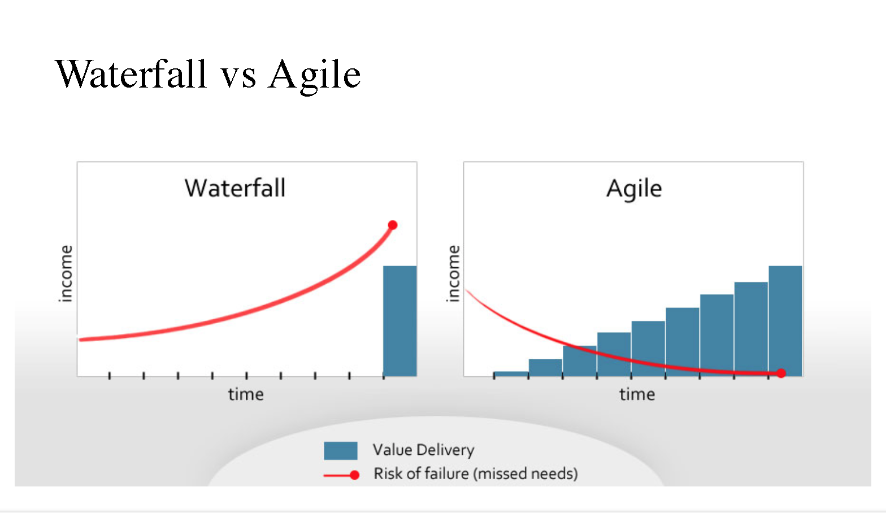
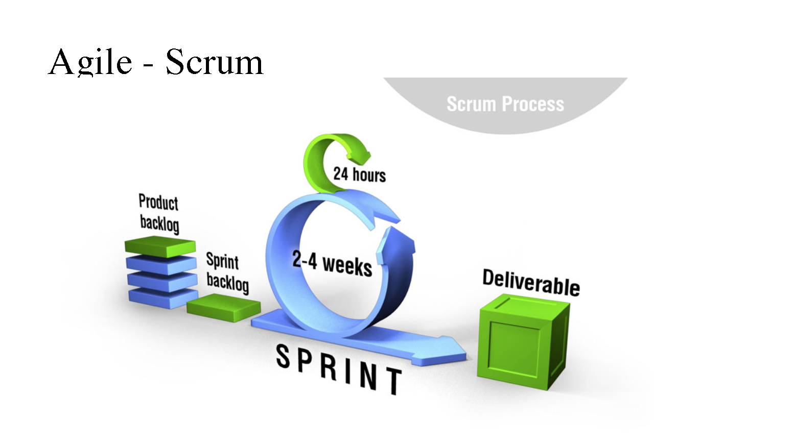

# Jira & Agile 

## Jira
- Jira benefits
  - Record
  - Share
  - Track
  - Statistc
  - Improve
- Create a Issu
  - Title
     - summary(aim clear),concise
  - Types: **reasonable**
     1. Epic: **level1** 
         - A Big user story that needs to be broken down (close a module,part of system); 
         - module, **sereral months**
     2. Story: **level2** 
         - A user Story (A Feature user can feel)
         - **1-2 sprint** (sprint: 1~2 week)
     3. Improvement: **level2** 
         - An improvement or enhancement to an exeisting feature or task;
         - **refer to story**
     4. New Feature: **level2** 
         - A New feature of the product,which has yet to be developed;
         - **refer to story**
     5. Bug: **level2**
         - bug
         - **refer to story**
     6. Task: **level2** 
         - just need to do one thing,not Epic,not Story ;
         - **refer to story**
     7. Sub-Task: **level3** 
         - A sub-task of the Issue(steps to finish a story);
         - **1day, no more 3day**
     8. Technical Task: **level3**
         - similar Sub-Task **Technical**; 
         - **1day ,no more 3day**
     9. Story vs New Feature:
         - story can be split,long time work,from 0 to 1; 
         - little Story is New Feature ,from 1 to 100.
  - Priority:fact
     1. Block: you block other ,do it now.(stop world,have a talk) **level1**
     2. Critical: very important,do it as soon as possible(none block). **level2**
     3. Major: important ,must do it.(bug init level)  **level3**
     4. Minior: not important bt should do it sometime.**level4**
     5. Trivial: do it when you free.**level5**
  - Estimate & Log work: **Experience & keep logging**
     - keep estimationg
     - keep logging
     - keep reviewing
     - waiting for improvement
  - Description: **more detail**
     1. **level1**: Error Message
     2. **level2**: **Leve1**+Background(context)
     3. **level3**:
         - **level2**+Analysis
         - Ease the reproduction
- Let the jira **flow**
     - **No flow, no value!**
     
## Agile
- Manifesto
   1. **Individuals and interactions** over process and tools
   2. **Working software** over comprehensive documentation
   3. **Customer collaboration** over contract negotiation
   4. **Responding to change** over following a plan
- Waterfall vs Agile 
- Kanban
   1. Visualize the workflow
   2. Limit Work in Process(less then 3 things one people one time)
   3. Focus on Flow
   4. Continuous Improvement
- Scrum 
  - Flow
     1. product backlog
     2. sprint backlog
     3. sprint(2~4 weeks), 24hours Scrum Sub Sprint
     4. Deliverable
    
  - compent & actors： **backlog**: Request list
     1. PO: Product owner
     2. SM: Scrum master
     3. Team: Team members
  - Meeting
     1. Sprint Planning Meeting
     2. Daily Scrum Meeting
     3. Sprint Review Meeting
     4. Sprint Retrospective Meeting
- Kanban vs Scrum

  item | Scrum | Kanban  
  -----|-------|------  
  Cadence|Regular fixed length sprints(ie: 2weeks)| Continupus Flow
  Release methodolgy|At the end of each sprints of approved by the product owner|Countinuous delivery or at the team`s discretion|
  Roles|Product owner,Scrum master,development team|No existing roles.Some teams enlist the help of an agile coach|
  key metrics|Veloctity|Cycle time|
  Change philosophy|Teams should stive to not make changes to the sprint forecast during the sprint.Doing so compromises learnings around estimation|Change can happen at any time|

## Q/A
- Jira 很有意义
- Issue 的描述到方便重现
- 任务类型大小匹配
- 流动起来
- Agile Manifesto
- Kanban, WIP
- Scrum、Sprint、3中角色、4中会议 
