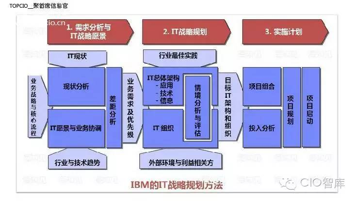

#系统架构设计方法论——IBM架构解决方案设计
- **IBM的IT战略规划方法**:

- **IBM的IT战略规划三个阶段**:

##架构设计方法论
IBM内部有一套自成体系的架构设计方法论，且是和TOGAF所互相承认效力的。相比较而言，IBM的架构设计理论，在实际上的可操作性会更强，也可以说是功利性更强些。当然，也会更容易落地使用。
该理论包括5个架构设计的步骤：

1. 理解客户的业务和需要（Understand Client's Bussiness and Needs）
具体的理解范围包括：
  - 客户的业务发展方向，Business Directions
  - 当前组织结构，Current Organization Description
  - 当前IT环境，Current IT Environment
  - 标准约定，Compliance Standards
  
   ***第一次会议***时间节点，与公司高层沟通企业架构愿景

2. 探索方案和方法（Explore Options and Approach）
方案和方法包括：
  - 项目定义，Project Definition
  - 系统上下文，System Context
  - 主题模型，Subject Area Model，即表单实体
  - 功能性需求列表，Functional Requirement Matrix
  - 非功能性需求，None Functional Requirement
  - 用例图，Use case Diagram
  - 架构决策，Architechtural Decision
  - 可行性评估，Viability Assesment

  ***第二次会议***节点，与公司业务规划部门和经营部门确认需求；按需要单独与公司高层沟通方案

3. 开发并与客户确认解决方案（Develop and Agree to Client Solution ）
解决方案包括：
   - 应用架构概况图，Architecture Overview Diagram
   - 架构部件（组件）模型图，Component Model
   - 系统运行部署图，Operational Model
  
   ***第三次会议***节点，项目启动会议。再次确认项目边界和验收标准。

4. 执行客户的解决方案（Implement Client Solution）
   - 项目里程碑
   - 项目测试报告
   - 项目需求实现确认

   ***不间断项目例会***阶段，和用户共同确认项目进度，测试结果等。

5. 确认客户的价值的体现（Confirm Client Value and Experience）

   ***项目总结会议***节点

全部工作中，设计部分主要是前三个步骤。