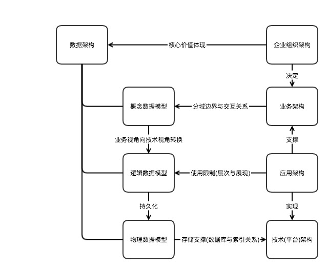

# 架构分类
## 架构分类和关系

## 企业组织架构
- 企业的本质是追求经济利益的社会组织(注，企业经营的本质是**增长**)。而在任何一种经济组织中，个人利益是组织成员行为的出发点，而且，在组织中，信息经常是不对称的，或者说，每个人并不总是享有同样的信息。这个理念暗示了**组织架构**的三个重要方面：**权力分配**、**业绩考核办法**和**奖励机制**。因此，一个好的组织架构通过实现**决策权**与**相应信息**的有效联系，从而做出高质量的决策；相应地，开发出业绩和奖励评估系统，以便为以个人利益为依据的决策者提供合理的激励，使得他们的决策有利于整个组织的价值。
- 组织架构是由企业管理者通过组成企业的各种隐性和显性的合同形成的。比如，决策权力通过正式的或非正式的工作说明分配给相应的雇员，而业绩评估和奖励则通过正式的或非正式的报酬合同予以确认。几乎所有的企业管理者都认为，“人”是企业最重要的资产，而组织架构就是解决企业中“人”的问题。
- 不同公司的最优组织架构是不同的。这种架构的差别不是随意的，而是一种系统 的差别，是随着公司相关特征的不同而产生的。一般来说，相同行业的公司往往都有类似的架构（ **领域设计模式** ）。如果某个行业中重要的环境因素发生了变化，绝大多数公司都会对自己的决策权力分配以及内部控制系统做出调整。

- 一个企业的组织架构通常涉及到以下的主题：
  1.   权力分配和监督控制(**IT架构设计关注点**)
  2.   任务分配和工作单位的形成(**IT架构设计关注点**)
  3.   如何吸引和留住合格的雇员
  4.   激励性报酬
  5.   个人业绩评估
  6.   部门或团队业绩评估

- 企业组织架构定义了企业部门组织关系，领导层次的结构。从人和企业的视角对业务和流程进行划分，明确权责对应关系，这将决定后续系统建设过程中的业务架构划分。了解企业组织架构可以对后续其他架构设计中的组件(业务，技术)划分，权责对等设计给予支持。企业组织架构的分析(和重构，企业架构的重构是公司高层和战略规划部门发起和执行的，权利决定一切)，应该是架构设计的第一步。

## 业务架构
- 企业业务架构（EBA:Enterprise Business Architecture）又称为企业运营模式，是企业战略转化为日常运营的机制。**业务架构**与**IT架构**的结合形成了企业运营的基础平台。业务架构定义了企业如何创造价值以及企业内外部的协作关系，描述了企业如何**满足客户的需求**、**进行市场竞争**、**与合作伙伴合作**、**建立运营体系**、**考核绩效**等。
- 业务架构是基于战略决定企业各组成部分如何运转的工具，建立了企业战略与日常运营之间的关联关系。宏观层面的企业战略需要通过业务架构来进行分解，从战略范畴落实到战术范畴。日常运作的组织、流程、IT系统都应该是在**业务架构**指导下运转的。如果没有业务架构而直接组织和建立企业的日常运营， 就会出现运营与战略的脱节、各个业务环节缺乏统一协调等问题。
- 业务架构以企业战略作为输入，从业务人员视角去对公司业务流程的系统支撑的表述。（注：流程本身也是分层分类的）对产品或者项目的业务需求进行边界划分的方法论，目的就是明确业务边界和业务之间的联系和交互。不需要考虑技术实现和物理部署。
- 业务架构中需要定义的是业务实体和各个实体之间的信息交互流程，业务实体与企业组织实体应该是一一对应的，同时各个实体间的信息交互就是企业业务流程的体现。业务架构侧重在业务组件、流程、组件分布、内外包模型和架构治理五个方面。

### 业务组件
业务组件就是企业的业务模块。在企业架构中，通过业务组件化把企业的产品、销售、采购、生产、财务等业务功能转变为业务模块，具体的方法被称为“业务组件建模”，简称为CBM（Component Based Modeling），CBM通过企业功能组件化的方式对企业进行重新定义和组合的过程，在一张图上就可以直观地显示出企业的业务蓝图；CMB不仅仅是对企业高层次的描述，而是一个内容丰富的业务模型设计工具，它采用了一种全新的视角—组件化的方式对企业进行分析和设计。

- 业务组件模型(CBM)有着广泛的用途，在企业管理中主要有以下四项用途：
  1.   战略分析
  2.   业务模式转型
  3.   流程设计
  4.   支持SOA系统设计

业务组件的定义模板可以在CBM总图的基础上，详细描述组件的价值、活动、资源、考核、IT支持等信息。由于业务组件是企业架构设计中的基础性工作，清晰的定义会给后续的流程、组织、分布模式、IT系统等的设计工作打下坚实的基础。

- 业务组件具有以下特点：
  1.   业务组件是独立的业务模块，在企业系统中承担特定的职责。组件可以由企业自己完成，或者由合作伙伴完成。企业组件化的过程也是内部和外部专业化的过程，企业可以通过组件化建立价值网络，重复利用外部资源来提升自己的竞争力。
  2.   组件内部各个活动之间是紧密关联的，而与外部其它组件的关联程度较低。所以组件是可以独立运作的，这使专业化分工和外包成为可能。
  3.   每个业务组件的输入和输出都高度标准化。组件不能够直接使用其它组件内部的活动或者资源，只能根据组件之间的标准接口提出服务请求，从而获得所需的服务。
  4.   组件一般都拥有自己的资源，它们在完成特定的有价值的活动中会消耗这些资源。也存在没有资源的组件，它们只能通过调用其它组件资源的方式来实现自己的功能。
  
现在的企业都在向流程化转型，这是IT驱动的必然。然而，企业流程再造需要在企业总体层面上进行运营体系的优化，不能使之成为基于各个部门内部进行的局部优化遭。

### 业务流程
流程设计的方法比较多，著名的有六西格玛、BPR、BPM等。许多企业和咨询公司也在实践中总结了自己的流程设计方法论。流程设计的工具也较多，例如，PPT、Visio、UML、IDEF3、ARIS,或者IBM Websphere Modeler等专业的流程建模和模拟软件等。
在流程设计中，需要考虑业务组件模型、业务组件分布模型、内外包模型、现有业务流程中的问题、对未来业务发展的设想等因素。当然，流程设计和以上这些模型的设计是交互的，可能会发生由于流程设计的原因，而对这些模型进行调整的情况。重要的是业务架构设计各个方面的设计成果之间需要保持一致，而不要发生冲突或者遗漏。这些因素都是“架构管理”的内容。
设计好流程后，要通过流程模拟软件或者财务模型来预测新流程的效果，要保证预测结果的准确性，其前提条件是流程得到了全面的实施。注意：设计和评估是一个迭代的过程，通过不断改进和调整，可以逐步使流程设计与业务目标更加接近。
### 组件分布
**组件分布模型**（Location Model）又被称为属地模型，是企业业务架构中决定业务活动在什么地点进行执行的模型。通过客户接触程度和作业量两个维度，对企业的业务组件进行评估，就可以发现哪些组件可以集中，哪些组件需要分散处理。

- **接触客户的程度** 衡量一个业务组件或业务活动是否需要面对面地接触客户。把企业的组件按照接触程度进行布局，就可以决定该组件或活动是集中还是分散。
- **作业量** 从运营作业量的角度来衡量业务组件或业务活动的作业规模，根据作业量的大小，决定业务组件或活动专业化或自动化的程度。

在下图中，左边的评估矩阵说明了每个象限的特点。在设计分布模式的时候，需要分析各个组件符合四个象限中哪个象限的特点，并放到相应的位置上。图中右边的矩阵是对四类业务组件的设计方案或改造措施。

在通过评估矩阵发现业务组件的集中或分散的属性以后，还需要考虑以下的限制性条件，对集中或分散的组件进行调整。

  1. 运营成本：在集中或者分散以后，是否会降低成本，是否会产生规模效益。
  2. 风险控制：是否有利于业务运营中风险点的控制，降低风险可能带来的损失。
  3. 监管要求：政府是否有监管的要求，会不会对集中或者分散处理产生监管障碍。
  4. 接受程度：主要是指外部的合作伙伴或者客户是否对集中或者分散有一定的要求，能否接受企业的集中或者分散的操作模式。对于企业内部的接受程度不作为重点的考虑对象，可以通过变革管理等手段来解决。
### 内外包模型
内外包模型是业务架构中决定企业采用何种内外包方式，即由企业内部完成某个组件的功能，还是由外部合作伙伴来提供该功能。通过以下的评估矩阵对业务组件的评估（前提是已经确定了企业的业务组件），能够发现哪些组件影响企业的核心竞争力，这些组件需要由企业自己负责；对于哪些在行业内没有差异性的组件，则可以外包。

每个业务组件可根据上图所示的差异性和同质化、企业特色和行业通用两个维度进行评估……
通过以上的评估矩阵发现适合外包的组件以后，还需要考虑以下的限制性条件，过滤掉由于不满足限制性条件而不能外包的组件：

  1. 市场成熟度：在企业运营的地区内，是否存在能够提供可靠、高质量、足够的处理能力的外包商或者合作伙伴。
  2. 政府监管：政府是否有监管的要求，是否允许外包或者由合作伙伴运营特定的业务活动。
  3. 外包接受度：企业员工或者客户是否比较容易接受对某业务组件的外包。
  4. 外部对企业的接受程度：外包商或者潜在的合作伙伴是否对合作对象有一定的要求，企业是否符合这样的要求。
外包有很多方式，我们在此仅仅提出了一些基本的思路。外包最重要的是充分发挥价值网络的优势，建立企业差异化的、创新的发展模式。

### 业务架构治理
设计一个先进的业务架构只是成功的一半，要管理和实施好业务架构，还需要做更多的工作，例如，从企业管理的层面来讲，需要相应的系统化管理模式来作为保障；从具体的执行上看，需要有一种机制来控制和推动业务架构的实施，这就是业务架构治理，通常由企业的运营部或者战略发展部来承担这个责任。
业务架构治理是企业治理之下的治理体系的一部分，企业治理是企业指挥和控制的过程，界定了股东、董事会、经理层等利益相关者的关系，这些利益相关者决定了企业的发展目标和方向。而业务架构治理则明确企业的目标能够在日常运营中实现，规定相关的职责、管理流程和方法等，来保证设计先进的业务架构并加以实施。业务架构治理使运营与企业战略目标相适应，通过运营的提升达到业务增长、成本降低、灵活反应等企业战略目标。

- 业务架构治理的目的：
  1. 使业务的运营与企业的要求相符合，管理多个部门的日常指标，发现业务运转的趋势并及时做出调整；
  2. 分析研究、设计、测试新的运营模式和流程，以解决问题或改进业务指标；
  3. 设计业务架构的发展路线图，根据业务的重要性来决定实施优先级。
- 业务架构治理组成部分：
  1. 指导原则：规定业务架构的规范和目标，设计评估指标。
  2. 方法：明确设计、管理以及实施业务架构和模型的方法。
  3. 治理流程：主要有合规流程、更新流程、沟通流程等。
  4. 角色与责任：明确业务架构设计以及日常运营中的管控角色和责任。

## IT架构
- 伴随着IT已经成为企业管理和运营的基础技术,IT架构与业务架构是相互支持和相互促进的。有数据研究结果表明，单独IT架构的优化可以为企业带来2%的业务增长；单独业务架构的优化可以带来8%的业务增长；而业务和IT相互支持，企业达到总体优化，则可以带来20%的业务增长。IT促进企业同时发生着如下转型：
  1. 以数据为核心价值的，数据经营企业。
  2. 面向服务型的企业。
 
- IT架构是企业IT建立IT系统的基础，它会指导IT的发展方向和项目的开展。企业的IT架构能够帮助企业解决以下的问题：  
  1. IT如何支持业务的发展?  
  2. IT项目开发的理由是什么?如何实现IT的投资回报?  
  3. 企业的技术如何发展？为什么采用某个技术(或产品)?由谁决定?决定的依据是什么?  
  4. 如何向股东和企业管理层展示IT的价值？并持续获得支持和投资?  
  
- **企业IT架构**的内容包括**数据架构**、**应用架构**和**技术架构**三个方面。和以上三个名词有很多对等和相似的名词如: 数据架构，信息架构；应用架构，系统架构，应用系统架构，功能架构；技术架构，部署架构等等。

### 数据架构
逻辑层次上的“业务实体”落地到物理层次上的实际数据的组织形式和各种类型数据的存储方案（存储组件的使用）即为数据架构。数据越发的成为企业的核心资产。从IT架构的角度来看，数据架构是整个IT系统的核心资产，整个系统的运行受到数据架构的支配和限制。
数据架构的分解与其他架构关联关系:

  
**数据**（data）是描述事物的符号记录;是对**信息**这个抽象概念的**逻辑和物理支撑**在逻辑上对信息进行呈现，在物理上对信息进行持久化存储。**模型**（Model)是现实世界的抽象，更进一步应该说是对关系形式上的表现如下。**数据模型**（Data Model）是数据特征(实体呈现和关系规约)的抽象，也是数据架构的表现形式。

- **数据模型**所描述的内容包括三个部分：数据结构、数据操作、数据约束。  
   1. **数据结构**:数据模型中的数据结构主要描述数据的类型、内容、性质以及数据间的联系等。数据结构是数据模型的基础，数据操作和约束都建立在数据结构上。不同的数据结构具有不同的操作和约束。  
   2. **数据操作**:数据模型中数据操作主要描述在相应的数据结构上的操作类型和操作方式。  
   3. **数据约束**：数据模型中的数据约束主要描述数据结构内数据间的语法、词义联系、他们之间的制约和依存关系，以及数据动态变化的规则，目的是保证数据的正确、有效和相容。
   
- **数据模型**按不同的应用层次分成三种类型：分别是概念数据模型、逻辑数据模型、物理数据模型。企业数据架构的范围要根据实际情况来决定，可以只包括概念数据模型，或者进一步包含逻辑数据模型。
   1. **概念数据模型**（Conceptual Data Model）：简称概念模型，是面向数据库用户的现实世界的模型，主要用来描述世界的概念化结构，设计人员使用概念模型在设计初期摆脱计算机系统及DBMS(数据管理系统。注，均不是特指关系型数据管理系统RDBMS)的具体技术问题，集中精力分析数据以及数据之间的联系等，与具体DBMS无关。概念数据模型必须换成逻辑数据模型，才能在DBMS中实现。在概念数据模型中最常用的是E-R模型、扩充的E-R模型、面向对象模型及谓词模型。
   2. **逻辑数据模型**（Logical Data Model）:简称数据模型，这是用户从数据库所看到的模型，是具体的DBMS所支持的数据模型，如网状数据模型(Network Data Model)、层次数据模型(Hierarchical Data Model)和关系数据模型(Relation Data Model)等等。此模型既要面向用户，又要面向系统，主要用于DBMS的实现。在逻辑数据类型中最常用的是层次模型、网状模型、关系模型。
   3. **物理数据模型**（Physical Data Model）:简称物理模型，是面向计算机物理表示的模型，描述了数据在储存介质上的组织结构，它不但与具体的DBMS有关，而且还与操作系统和硬件有关。每一种逻辑数据模型在实现时都有起对应的物理数据模型。DBMS为了保证其独立性与可移植性，大部分物理数据模型的实现工作又系统自动完成，而设计者只设计索引、聚集等特殊结构。物理数据模型通常不包含在数据架构设计内，它属于系统设计和开发的范畴。企业数据架构所起的作用是规划和指导，为此，没有必要加入过多的细节。
- 企业数据架构根本目的是为了消除信息孤岛，建立一个共享、通用、一致和广泛的企业数据基础平台。同时，数据共享和用户对数据的权限应该在应用系统架构中给予定义和限制。

### 数据流架构

### 信息架构？
信息是逻辑概念，需要落地到物理上存储。从实体角度出发信息架构即是数据架构。
### 应用架构（应用系统架构）
每种业务都有自己的业务实体（融入业务特征的信息实体），在业务流程中也使用业务实体进行信息传递。应用系统就是对业务实体进行管理并在应用系统间完成传递，实现实际的业务价值（信息流产生价值），支持这些业务活动的应用系统合在一起就形成了应用系统架构。
应用架构的目的是建立企业的业务架构和数据架构与具体的IT之间的关联。应用架构不是对某个系统的设计或者需求的分析，而是定义企业向业务部门提供的整体的IT应用系统和功能。
应用架构在IT架构中发挥核心的作用，它能够连接业务架构中的流程、组件、功能、人员，也能够连接数据架构中数据的管理和使用，还能够提出对于技术架构和IT基础设施的要求。因而，制定一个完整全面的引用架构对于IT系统的建设非常重要。
应用架构是一个全企业的单一视图，规划定义IT系统和他们之间的接口以及集成方式，这样可以避免各个部门从自己的角度出发，建立很多烟道式的、重复的、难以共享的应用系统。应用架构理论的引入，可以解决企业目前在开发和系统集成过程中面临的很多问题。
### 系统架构？
应用和系统的对等和包容关系，应用*应用=系统=应用。所以应用架构也称为应用系统架构。
### 功能架构？
- 应用是功能的合集，是真正的实现功能的实体和表现形式。所以从实体角度看应用架构对功能架构是包容关系。功能\*功能=应用\+功能=应用。 
- 有很多时候使用功能架构代指了应用架构。同时功能架构也会错误的和业务架构混淆。 

### 技术架构
技术架构是IT架构中底层的架构，它定义了如何建立一个IT运行环境来支持**数据架构**和**应用架构**，以保证业务的正常开展。

- 技术架构不是对软件开发、硬件系统、网络通信等的需求分析，而是设计一个IT平台。技术架构的设计团队成员需要具有丰富的**软件**和**硬件**知识。
- 通常在业务架构、数据架构和应用架构设计完成之后再开始技术架构的设计，保证设计结果能够提供对业务和应用系统的支持并保持一致。
- 技术架构的内容比较广泛，通常分为**技术平台**和**基础设施**两大类。

####平台架构(技术平台)
- 应用系统要能正常运行，必然离不开服务器、操作系统、中间件、网络环境等基础技术环境的支持，这些底层的基础环境形成了技术架构（个人意见，简单的应用部署环境中，技术和部署架构可以合二为一）。
- 个人理解技术架构应该是技术组件架构，针对于分布式架构组织方式（PAAS使用），应用对组件的使用应该成为技术架构的理解。  

#### 部署架构(基础设施)
针对分布式部署的复杂性，有必要将应用（包含组件）和基础的应用组件的具体部署，服务器，云计算资源，网络资源，安全管控设备和策略的使用，以及不同的程序实体和物理实体的部署组合进行详细阐述，这就构成了部署架构。
