# 一 概念数据模型、逻辑数据模型、物理数据模型

##数据模型
数据模型由三部分组成：数据结构、数据操作和数据约束。

- 数据结构：数据结构主要描述数据的类型、内容、性质、以及数据之间的联系，是整个数据模型的基础，而针对数据的操作和数据之间的约束都是建立在数据结构的基础上的；
- 数据操作：主要定义了在相应的数据结构上的操作类型和操作方式（数据库中的增删改查等）；
- 数据约束：数据约束主要用来描述数据库中数据结构之间的语法、词义联系以及彼此之间的相互约束和制约关系（如MySQL中使用外键保证数据之间的数据完整性）；

## 概念数据模型（CDM）
概念数据模型是现实世界到信息世界的第一层抽象，主要是在高水平和面向业务的角度对信息的一种描述，通常作为业务人员和技术人员之间沟通的桥梁。作为现实世界的概念化结构，这种数据模型使得数据库的设计人员在最初的数据库设计阶段将精力集中在数据之间的联系上，而不用同时关注数据的底层细节（如所用的计算机系统的特性以及数据库管理系统---DBMS的特性）。

概念数据模型主要的贡献在于分析数据之间的联系，它是用户对数据存储的一种高度抽象，反应的是用户的一种业务层面的综合信息需求。

在这个阶段一般会形成整个数据模型或者是软件系统中的实体的概念以及实体之间的联系，为构建逻辑数据模型奠定基础。下图中描述了现实世界和信息世界以及最终转换成计算机世界信息的转换流程。

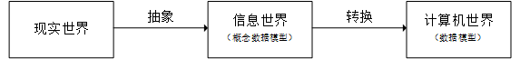

设计概念数据模型的主要工具是E-R图，扩展的E-R图。

## 逻辑数据模型（LDM）
逻辑数据模型是对概念数据模型进一步具体化，在概念数据模型定义实体的基础上定义了各个实体的属性，是用户从数据库的角度能够看到的数据的模型，是所使用的数据库管理系统（Database Management System，DBMS）所支持的数据类型（网状数据模型、层次数据模型、关系数据模型）。这种数据模型架起了用户和系统之间的桥梁，既要面向用户，同时也考虑到了所用的DBMS所支持的特性。
逻辑数据模型反映了系统分析设计人员针对数据在特定的存储系统（如MySQL）的观点，是对概念数据模型的进一步细化和划分。逻辑数据模型是根据业务之间的规则产生的，是关于业务对象、业务对象数据以及业务对象彼此之间关系的蓝图。

逻辑数据模型的内容包括所有的实体、实体的属性、实体之间的关系以及每个实体的主键、实体的外键（用于维护数据完整性）。其主要目标是尽可能详细的描述数据，但是并不涉及这些数据的具体物理实现。逻辑数据模型不仅会最终影响数据库的设计方向，并最终会影响到数据库的性能（如主键设计、外键等都会最终影响数据库的查询性能）。

逻辑数据模型是开发物理数据库的完整文档，逻辑数据模型主要采用的是层次模型、网状模型、关系模型，其中最常用的是关系模型，对应的数据库称之为关系型数据库，如MySQL。

## 物理数据模型（PDM）
物理数据模型，又称为物理模型，是概念数据模型和逻辑数据模型在计算机中的具体表示。该模型描述了数据在物理存储介质上的具体组织结构，不但与具体的数据库管理系统相关，同时还与具体的操作系统以及硬件有关，但是很多工作都是由DBMS自动完成的，用户所要做的工作其实就是添加自己的索引等结构即可。

物理数据模型是在逻辑数据模型的基础上，综合考虑各种存储条件的限制，进行数据库的设计，从而真正实现数据在数据库中的存放。其主要的工作是根据逻辑数据模型中的实体、属性、联系转换成对应的物理模型中的元素，包括定义所有的表和列，定义外键以维持表之间的联系等，具体例子如下：
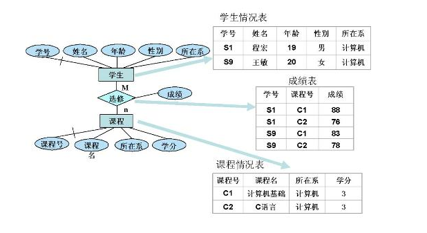

# 二 逻辑数据模型之层次数据模型、网状数据模型和关系数据模型

## 层次数据模型
- **定义**：层次数据模型是用树状<层次>结构来表示实体类型和实体间联系的数据模型。其实层次数据模型就是的图形表示就是一个倒立生长的树，由基本数据结构中的树（或者二叉树）的定义可知，每棵树都有且仅有一个根节点，其余的节点都是非根节点。每个节点表示一个记录类型对应与实体的概念，记录类型的各个字段对应实体的各个属性。各个记录类型及其字段都必须记录。

- **特征**:树的性质决定了树状数据模型的特征
   1. 整个模型中有且仅有一个节点没有父节点，其余的节点必须有且仅有一个父节点，但是所有的节点都可以不存在子节点；
   2. 所有的子节点不能脱离父节点而单独存在，也就是说如果要删除父节点，那么父节点下面的所有子节点都要同时删除，但是可以单独删除一些叶子节点；
   3. 每个记录类型有且仅有一条从父节点通向自身的路径；

- **实例**：
   如图，以学校某个系的组织结构为例，说明层次数据模型的结构。
   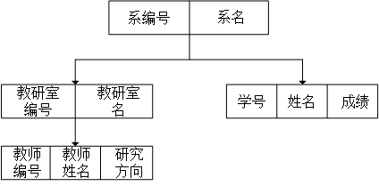
   1.  记录类型系是根节点，其属性为系编号和系名  
   2.  记录类型教研室和学生分别构成了记录类型系的子节点，教研室的属性有教研室编号和教研室姓名，学生的属性分别是学号、姓名和成绩  
   3.  记录类型教师是教研室这一实体的子节点，其属性由教师的编号，教师的姓名，教师的研究方向。

- **优点**：
    1. 层次数据模型的结构简单、清晰、明朗，很容易看到各个实体之间的联系；
    2. 操作层次数据类型的数据库语句比较简单，只需要几条语句就可以完成数据库的操作；（百度百科）
    3. 查询效率较高，在层次数据模型中，节点的有向边表示了节点之间的联系，在DBMS中如果有向边借助指针实现，那么依据路径很容易找到待查的记录；
    4. 层次数据模型提供了较好的数据完整性支持，正如上所说，如果要删除父节点，那么其下的所有子节点都要同时删除；如图1，如果想要删除教研室，则其下的所有教师都要删除；

- **缺点**：
    1. 层次数据模型只能表示实体之间的1:n的关系，不能表示m:n的复杂关系，因此现实世界中的很多模型不能通过该模型方便的表示；
    2. 查询节点的时候必须知道其双亲节点的，因此限制了对数据库存取路径的控制；

##网状数据模型
- **定义**：用有向图表示实体和实体之间的联系的数据结构模型称为网状数据模型。其实，网状数据模型可以看做是放松层次数据模型的约束性的一种扩展。网状数据模型中所有的节点允许脱离父节点而存在，也就是说说在整个模型中允许存在两个或多个没有根节点的节点，同时也允许一个节点存在一个或者多个的父节点，成为一种网状的有向图。因此节点之间的对应关系不再是1:n，而是一种m:n的关系，从而克服了层次状数据模型的缺点。
- **特征**：
  1. 可以存在两个或者多个节点没有父节点；
  2. 允许单个节点存在多于一个父节点；网状数据模型中的，每个节点表示一个实体，节点之间的有向线段表示实体之间的联系。网状数据模型中需要为每个联系指定对应的名称。
- **实例**：　　
  同样是以教务管理系统为例，下面说明了院系的组成中，教师、学生、课程之间的关系。
  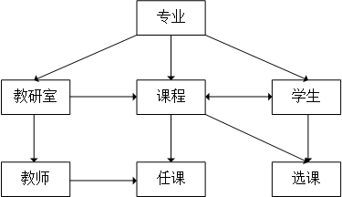
  由上图中可以看出课程（实体）的父节点由专业、教研室、学生。以课程和学生之间的关系来说，他们是一种m:n的关系，也就是说一个学生能够选修多门课程，一门课程也可以被多个学生同时选修。
- **优点**：
  1. 网状数据模型可以很方便的表示现实世界中的很多复杂的关系；
  2. 修改网状数据模型时，没有层次状数据模型的那么多的严格限制，可以删除一个节点的父节点而依旧保留该节点；也允许插入一个没有任何父节点的节点，这样的插入在层次状数据模型中是不被允许的，除非是首先插入的是根节点；
  3. 实体之间的关系在底层中可以借由指针指针实现，因此在这种数据库中的执行操作的效率较高；
- **缺点**：
  1. 网状数据模型的结构复杂，使用不易；
  2. 网状数据模型数据之间的彼此关联比较大，该模型其实一种导航式的数据模型结构，不仅要说明要对数据做些什么，还说明操作的记录的路径；

##关系型数据模型
- **定义**：使用表格表示实体和实体之间关系的数据模型称之为关系数据模型。关系型数据库是目前最流行的数据库，同时也是被普遍使用的数据库，如MySQL就是一种流行的数据库。支持关系数据模型的数据库管理系统称为关系型数据库管理系统。
- **特征**：
  1. 关系数据模型中，无论是是实体、还是实体之间的联系都是被映射成统一的关系---一张二维表，在关系模型中，操作的对象和结果都是一张二维表；
  2. 关系型数据库可用于表示实体之间的多对多的关系，只是此时要借助第三个关系---表，来实现多对多的关系，如下例子中的学生选课系统中学生和课程之间表现出一种多对多的关系，那么需要借助第三个表，也就是选课表将二者联系起来；
  3. 关系必须是规范化的关系，即每个属性是不可分割的实体，不允许表中表的存在；
- **实例**：
下面以学生选课系统为例进行说明。学生选课系统的实体包括：学生、教师、课程；其联系一般为学生与课程之间是一种多对多的关系，教师与课程之间是多对多的关系。学生可以同时选择多门课程，一门课程也可以同时被多个学生同时选择；一位教师可以教授多门课程，一门可能可以由多个教师教授。因此他们之间的联系如下：

  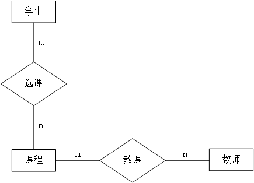

  关系落地

  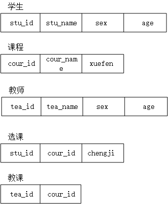

从中可以看到学生与课程之间的联系以及教师和课程之间的多对多联系都被映射成了表格。其中选课表中的sut_id和cour_id分别是引用学生表和课程表的cour_id的外键；教课表也是如此。

- **优点**：
  1. 结构简单，关系数据模型是一些表格的框架，实体的属性是表格中列的条目，实体之间的关系也是通过表格的公共属性表示，结构简单明了；
  2. 关系数据模型中的存取路径对用户而言是完全隐蔽的，是程序和数据具有高度的独立性，其数据语言的非过程化程度较高；
  3. 操作方便，在关系数据模型中操作的基本对象是集合而不是某一个元祖；
  4. 有坚实的数学理论做基础，包括逻辑计算、数学计算等；
- **缺点**：
  1. 查询效率低，关系数据模型提供了较高的数据独立性和非过程化的查询功能（查询的时候只需指明数据存在的表和需要的数据所在的列，不用指明具体的查找路径），因此加大了系统的负担；
  2. 由于查询效率较低，因此需要数据库管理系统对查询进行优化，加大了DBMS的负担；

###关系数据模型的三种约束完整性：
关系数据模型定义了三种约束完整性：实体完整性、参照完整性以及用户定义完整性。

- 实体完整性：实体完整性是指实体的主属性不能取空值。实体完整性规则规定实体的所有主属性都不能为空。实体完整性针对基本关系而言的，一个基本关系对应着现实世界中的一个主题，例如上例中的学生表对应着学生这个实体。现实世界中的实体是可以区分的，他们具有某种唯一性标志，这种标志在关系模型中称之为主码，主码的属性也就是主属性不能为空。

- 参照完整性：在关系数据库中主要是值得外键参照的完整性。若A关系中的某个或者某些属性参照B或其他几个关系中的属性，那么在关系A中该属性要么为空，要么必须出现B或者其他的关系的对应属性中。如上表中的选课关系的stu_id和cour_id分别是参考学生和课程的外键，那么对于现实的系统而言，stu_id和cour_id必须分别出现在学生和课程关系中，这就是外键参考的完整性，同时删除的时候根据设置的不同有不同的处理方式。

- 用户定义完整性：用户定义完整性是针对某一个具体关系的约束条件。它反映的某一个具体应用所对应的数据必须满足一定的约束条件。例如，某些属性必须取唯一值，某些值的范围为0-100等。

# 三 概念数据模型到逻辑数据模型的转化

## 码
首先，说明一下数据库中经常用到的用于标示一条记录（元组）的的码的概念，码又分为超码、候选码、主码。

- 超码：在一个关系中，可以用来唯一标识一个元组的属性的集合称之为超码。
- 候选码：在一个关系中，能够用来唯一标识一个元组的最少属性集合称之为候选码。
- 主码：在一个关系中，如果用来唯一标识一个元组的候选码中只有一个属性，则这个属性称之为主码。

三者之间的关系如下：超码是候选码的超集，候选码是主码的超集。下面以一个讲解清楚。假设一个关于学生信息的表格student，其中的属性有，stu_id(学号)，name(姓名)，age(年龄)，address(地址)。那么超码可以由所有的属性组成的集合构成，例如（stu_id，name，age，adress）、（stu_id，name）、（stu_id，age）等都可以叫做student的超码；候选码为（stu_id）；因为候选码只是由其中的一个属性组成，因此这个候选码又可以称之为主码。

## 概念数据模型到逻辑数据模型的转化（以关系数据模型为例）

概念数据模型是用E-R图表示的，其中的三要素是实体、属性、联系。将概念数据模型转化为逻辑数据模型的步骤其实就是将E-R图中的各个部分转化为逻辑数据模型中使用的具体数据模型的各个部分。下面所说的逻辑数据模型指代的是关系数据模型。将概念数据模型转化为逻辑数据模型的大体规则如下：概念数据模型中的实体转化为逻辑数据模型中的关系，对应的实体的属性转化为关系数据模型关系的属性（也就是列）；根据实体之间联系的不同具有不同的处置策略。

实体之间的联系分为1:1、1：n、和m:n。下面分别对这三种联系转化为关系的步骤做讨论。

- **1:1**：这种关系是最好理解，同时也是最容易处理的关系。实体之间存在着一一对应的关系。在这种联系中，可以创建新的关系描述这种联系，这事将两个实体的主码作为新的关系的候选码；当然也可以不必创建新的关系，将一方关系的主码作为另一方关系的外键。例如两个关系A和B存在1：1联系，那么可以将A的主码作为B的外键，同时将B的主码作为A的外键，具体情况依据于具体的环境。以所做的红包的小练习为例，注册用户和账户之间存在着1:1的联系，用户管理者账户。E-R图如下：

   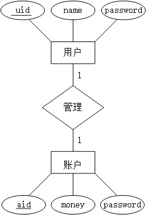  
   
　　用户与账户之间存在一一对应关系，但是创建账户的时候需要用户已经存在，因此这种情况下需要将用户的"uid"作为账户的外键，那么对应的关系如下：  
　　
   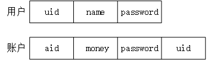

　　因为，在这个例子中额外的创建关系会导致不必要的额外存储空间的增加，因此不再重新创建额外的关系。

- **1:n**：一个实体可以对应额外的多个实体。这种联系中可以不必创建额外的关系表示二者之间的1:n的联系，此时只需要将“1”方的关系的主码放入到“n”方的关系的属性中作为其外键即可，同时将联系的属性加入到“n”方的关系中；当然也可以创建额外的关系表示二者之间的联系，那么“1”和“n”方的关系的主码作为候选码，同时将联系的属性加入到新建立的关系中。但是，这种情况下额外的创建新的关系显得冗余。还是以所练习的红包项目为例，一个大的红包根据指定的数值可以派生出很多的小红包。这两个实体分别对应着一个关系，其E-R图如下：
    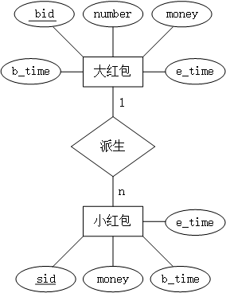  
    
　　由图得知，小红包必须依赖大红包存在，因此在小红包中将大红包的bid作为小红包的外键即可，这样就不必建立额外的关系了。对应的关系如下:  
　　
    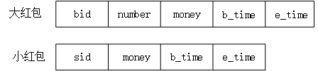
    
- **m:n**：对于这种多对多的联系，必须建立新的关系以描述这种联系。“联系”对应的关系的属性中至少包含他说关联的双方实体的“主键”，若联系也有自身的属性，那么该属性一样纳入新建立的关系的属性中。由于红包项目中没有遇到类似的联系，因此以最经典的学生选课系统为例。很明显学生选课系统中的实体对应有学生和课程，一个学生可以选修多门课程，一门可能可被多个学生选修，因此两个实体之间是一种多对多的关系，对应的E-R图如下：

    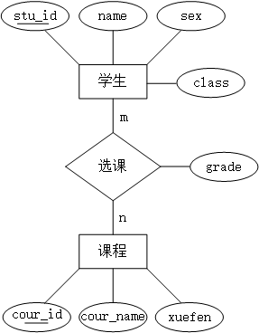  
    
    学生与课程之间存在着多对多的联系，因此建立起新的选课关系来描述这种联系。在新的关系中将学生的主码和课程的主码作为选课的候选码，学生的主码和选课的主码的组合会出现在对应的选课关系中。如果此时要查询一个学生的成绩，需要使用联合查询的方式。  
    
    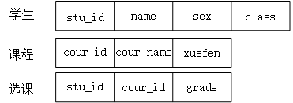