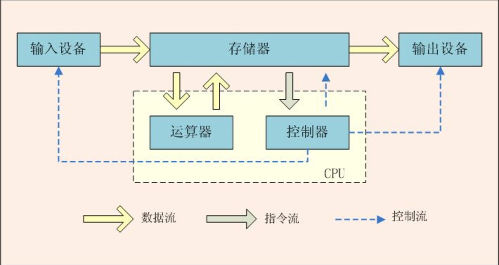

# 高并发技术体系理解
## 前言
未来早已带来 只是还未普及。马克思百年前就已经指出：生产效率提升，推动生产力的发展，最终推动社会的进步。当今的时代，互联网大行其道，已经深深的融入了生活和生产之中。互联网的浪潮不是已经到来而是已经在改变的这个世界。那么什么是互联网，互联网的作用又是什么呢。  
### 互联网
互联网的本质在于连接。互联网并没有改变物理世界的存在方式，互联网对我们的沟通方式和营销模式的改变虽然影响深远，但是它对对商业世界最根本的意义在于让每一个孤立无援的消费者第一次在网络的世界里彼此连接起来，以群体的方式展示自己的力量。互联网以连接的形式一定程度上的消除了信息不对称，并极大的降低了连接的代价，极高的提高了消费者的话语权。话语即权利，虽然话语在表面上看起来只是一种表达的方式，但是往往能说明拥有和行使话语权的人背后的价值取向，利益立场和诉求，所以通过话语能够看到不同利益群体所代表的价值取向和立场。在工业化以及之前的农业化时代，我们稀缺的是资源和产品，丰饶的是时间和注意力，无法连接的消费者没有话语权；后信息时代是一个真正个人化的时代，人不在被物所役，而是物被人所役。一方面是日新月异的技术进步，使企业难以形成持续的垄断，另一方面资源的无限丰沛，企业之间处于过度竞争，企业要发展，只能以好产品来讨好消费者。那么产品又是什么呢。
### 产品
产品的这个概念，是一个典型的缺乏主语的例子。产品配上主语就是，谁生产的一个东西。所以产品实际表达的某个主体所产生的东西。任何事物一定不能自己生产自己，一定有其产生的主体，这个主体一定不是这个事物本身，这是产品的另一层含义。人类要使用产品，即访问产品，首先要有一个目标，即产品本身；其次还需要一个访问途径，人类使用产品只有有限的几个方式，且和人体的结构有关系，古人已经帮我们总结的很到位了“眼、耳、鼻、舌、身”。这些感觉都需要通过空间才能够访问。因此产品生产方必须以某种方式来突破空间的限制，使用户能够在空间上访问到产品。由此可以知道产品只有达到上述二者才能够成功，所以人类生产的产品基本可以分为两类：制造类产品和服务类产品，服务类产品也可以称之为通道类产品。制造类产品是人类访问的目的地，通过产品本身的生命周期变化帮助人类解决人类的生存问题，这类产品自身生命周期变化的推进，支撑了人类的生命周期活动。为人类提供对制造类访问的空间通道，所形成的便是通道类产品，也就是服务类产品。服务类产品通过访问通道，解决了人类对外部世界的访问生命周期，连接人类和访问目的地。
对于上述两类两类产品的评价标准也有显著不同，制造类产品，以其在产品生命周期内对人类生命周期活动的支撑有效性来评价，人类对对其访问生命周期得到的支撑越多，访问生命周期的结果越好、质量越好。通道类产品，往往以访问的流量，便利性取胜，也就是让没给访问生命周期的时间越短越好，同时能够支撑的访问量越大越好。
### 高并发
从上文不难看出，互联网的本质是连接，从产品的角度来看是通道，是服务类产品；配合上主语，就是某个企业提供的服务。评价这个企业互联网产品应该让每个访问生命周期的时间越短越好，同时能够支撑的访问量越大越好。这不就是典型的高并发追求的吗。所以说高并发是互联网的生产力，是每一个互联网产品追求的目标。所以高并发是有意义的事情。

后文也会指出高并发是一个复杂的系统工程，一个人的力量是有限的，更何况是个才疏学浅的普通人，所以本文只是阐述个人对高并发的一些理解，不是严谨的科学论文，也不是完备的工程实施指南。如果产生错误的影响，先行致歉。
## 目录
## 从冯诺依曼体系结构说起
### 冯诺依曼体系结构
计算机的发展历史并不长，虽然发展的很快，但是目前主流还没有脱离主流的经典理论限制(量子计算不了解所以无法讨论)。所以要理解高并发还是需要回顾下，计算机运行的基础。

冯诺依曼体系结构特点如下：  

- (1)采用存储程序方式，指令和数据不加区别混合存储在同一个存储器中，数据和程序在内存中是没有区别的,它们都是内存中的数据,当EIP指针指向哪 CPU就加载那段内存中的数据,指令和数据都可以送到运算器进行运算，即由指令组成的程序是可以修改的。  
- (2)存储器是按地址访问的线性编址的一维结构，每个单元的位数是固定的。  
- (3)指令由操作码和地址组成。操作码指明本指令的操作类型,地址码指明操作数和地址。操作数本身无数据类型的标志，它的数据类型由操作码确定。  
- (4)通过执行指令直接发出控制信号控制计算机的操作。指令在存储器中按其执行顺序存放，由指令计数器指明要执行的指令所在的单元地址。指令计数器只有一个，一般按顺序递增，但执行顺序可按运算结果或当时的外界条件而改变。  
- (5)以运算器为中心，I/O设备与存储器间的数据传送都要经过运算器。
- (6)数据以二进制表示。

从以上定义可以简单理解计算其实就是在内存中找出指令，然后顺序执行这些指令并根据指令的提示对指令指定的数据进行操作并存储作为后续指令的数据源。从冯诺依曼体系结构的角度来看，针对单一控制器和运算器其实没有真正的并发。而且顺序执行的指令集合效率是最高的。
### 图灵机与图灵完备
一切可计算的问题都能计算，这样的虚拟机或者编程语言就叫图灵完备的。

在可计算理论中，当一组数据操作的规则（一组指令集，编程语言，或者元胞自动机）满足任意数据按照一定的顺序可以计算出结果，被称为图灵完备（turing complete）。一个有图灵完备指令集的设备被定义为通用计算机。如果是图灵完备的，它（计算机设备）有能力执行条件跳转（“if” 和 “goto”语句）以及改变内存数据。一个能计算出每个图灵可计算函数的计算系统被称为图灵完备的。一个语言是图灵完备的，意味着该语言的计算能力与一个通用图灵机相当，这也是现代计算机语言所能拥有的最高能力。也是大多数现代编程语言宣称达到的层次。所有的通用编程语言和现代计算机的指令集都是图灵完备的，都能解决内存有限的问题。图灵完备的机器都被定义有无限内存，但是机器指令集却通常定义为只工作在特定的，有限数量的RAM上。

复杂而绕口的定义，简单理解就是使用现在的通用编程语言通过顺序，分支，循环控制内存数据变化，构造出的有限状态机都是能够被现代计算机求解的，而无论状态执行的改变的顺序是什么样的。山顶只能有一个，但是上山的路是无数条的。也就是说逻辑上的并发和系统的串行只要能保证状态的转移的结果是一致的，那么就是正确的。

### 并发的理解
综上，软件实现并发本质上是将指令以及其操作的数据按照某种状态转移的形式组织起来，在计算体系结构上实际按照串行执行实现逻辑的并发效果。状态机最终能否实现逻辑正确是由软件设计者保证的。

## SMP，MMP与NUMA体系结构
软件运行的基础是硬件，所以理解所构造的软件的实际运行环境和运行方式很有必要。从系统架构来看，目前的商用服务器大体可以分为三类，即对称多处理器结构(SMP：Symmetric Multi-Processor)，非一致存储访问结构(NUMA：Non-Uniform Memory Access)，以及海量并行处理结构(MPP：Massive Parallel Processing)。这些体系结构中我们最常见的个人认为是NUMA架构。
### SMP
### MMP
### NUMA
### 三种架构特点比较
结构体系|SMP|NUMA|MPP
------|---|----|----
说明	|(Symmetric Multi-Processor)对称多处理系统(UMA：Uniform Memory Access)一致存储器访问结构|(Non-Uniform Memory Access)非统一内存访问|(Massive Parallel Processing)大规模并行处理
技术特点|性能的提升依赖于cpu的速度。容易产生瓶颈。|难以实现，特别是交叉开关。（这也是为什么大型机一直被IBM等垄断）|益于实现，可使用廉价设备部署。重点在于软件设计。
耦合度 	|紧耦合运算节点共享所有资源|	介于二者之间运算节点有独立内存，通过内部互联模块互联	|松耦合运算节点间不共享资源，通过网络互联。
扩展能力	|低	|中等	|高
现有规模	|2-4个cpu最优，IBM的BOOK技术能扩展到8个|	可支持上百个cpu	|以能支持数千cpu
瓶颈|内存访问冲突并且受总线带宽限制	|非本地内存访问的速度慢，交叉锁的延迟|网络速度
## 单机高并发--真正挖掘一个节点的潜能
### 线程的力量
### 缓存，内存与磁盘
### 同步与异步，阻塞与非阻塞
### 资源竞争与同步--Disruptor
### 内核网络协议栈的局限与内核旁路--DPDK
### 数据结构与算法
## 集群高并发--真正发挥一个整体的力量
#### 机器的不可靠性
#### 网络的不可靠性
### 集群协调
#### 2PC，3PC与事物补偿
#### Paxos与Raft
#### Batch与Pipeline
## 架构思维
### 高并发系统工程
世界上不存在孤立存在的事物，没有支撑与被支撑的技术体系是没有意义的。高并发如果没有周边系统的支撑是无法真正实现的，如果高并发系统不对其他系统形成支撑同样没有意义。高并发系统是一种综合的系统的工程，系统工程就需要在系统的开发和建设过程中通过架构设计全盘进行考虑。个人理解高并发系统需要保证**“快、稳、控”**三个要点
### 快
天下武功，唯快不破。  
- 开发快  
- 发布快  
- 调度快  
- 恢复快  
### 稳
高并发与高可用，似乎是天生一对。

### 控
没有刹车和转向系统的汽车，无论加速性能多么好，终速有多么高，都是不可驾驭的没有意义上的产品。失去了控制，无论处理速度有多快，并发多高，这样的系统都是没有意义的。
### 权衡与妥协
架构的本质其实就是分工与权衡。
架构不是一成不变的稳定态，架构同样处于不断的运动中，需要根据外界环境变化的触发进行调整。
## 总结
一切的技术都是为了业务服务的。无论什么样的系统都要保障业务的可用，可靠，高效。系统的意义和价值是由业务的成功程度定义的。而业务需要考虑业务的生命周期，成本收益，权益划分。业务有时候确实会受制于某些技术的硬性限制的，但是为了技术而技术或者业务是本末倒置的。同时，某些技术确实可以推动业务的发展，如同互联网至于电商，但是这也是建立在物流，支付等业务成熟开展的同时。不同业务对于技术标准的要求肯定是不同的，这就需要我们软件人跳出技术的层次，从更高的业务层面去考虑技术的实现路径。同时每项技术都有其特别的要求，只有深入到技术细节并在不断的实践趟坑的过程中去真正理解技术的最佳使用实践。要真正的做好一件事恐怕真的要有上天入地的勇气和信心。

以上，是个人从高并发作为切入对技术的有点理解。才疏学浅必有纰漏和错误，敬请谅解。
## 参考
