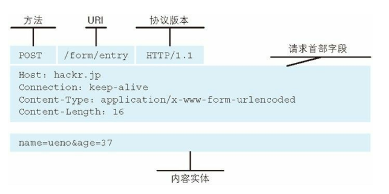
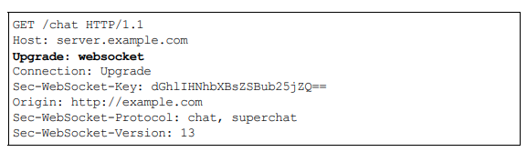

# HTTP协议

### http消息
#### URLFormat

#### http报文


##### 请求

##### 回复


###### 多部分回复实例


### 14种常用Code
- 2XX成功
  - **200 ok**
  - **204 No Content**:  
    该状态码代表服务器接收的请求已成功处理，但在返回的响应报文中不含实体的主体部分。另外，也不允许返回任何实体的主体。比如，当从浏览器发出请求处理后，返回 204 响应，那么浏览器显示的页面不发生更新。一般在只需要从客户端往服务器发送信息，而对客户端不需要发送新信息内容的情况下使用。
  - **206 Partial Content**:  
    该状态码表示客户端进行了范围请求，而服务器成功执行了这部分的
GET 请求。响应报文中包含由 Content-Range 指定范围的实体内容
- 3XX重定向
  - **301 Moved Permanently**:  
    永久性重定向。该状态码表示请求的资源已被分配了新的 URI，以后应使用资源现在所指的 URI。也就是说，如果已经把资源对应的 URI保存为书签了，这时应该按 Location 首部字段提示的 URI 重新保存
  - **302 Found**:  
  临时性重定向。该状态码表示请求的资源已被分配了新的 URI，希望用户（本次）能使用新的 URI 访问。和 301 Moved Permanently 状态码相似，但 302 状态码代表的资源不是被永久移动，只是临时性质的。换句话说，已移动的资源对应的URI 将来还有可能发生改变。比如，用户把 URI 保存成书签，但不会像 301 状态码出现时那样去更新书签，而是仍旧保留返回 302 状态码的页面对应的 URI
  - **303 See Other**:  
  该状态码表示由于请求对应的资源存在着另一个 URI，应使用 GET方法定向获取请求的资源。303 状态码和 302 Found 状态码有着相同的功能，但 303 状态码明确表示客户端应当采用 GET 方法获取资源，这点与 302 状态码有区别
   当使用 POST 方法访问 CGI 程序，其执行后的处理结果是希望客户端能以 GET 方法重定向到另一个 URI 上去时，返回 303 状态码。虽然 302 Found 状态码也可以实现相同的功能，但这里使用 303状态码是最理想的
  - **304 Not Modified**:  
  该状态码表示客户端发送附带条件的请求 (附带条件的请求是指采用 GET方法的请求报文中包含 If-Match，If-ModifiedSince，If-None-Match，If-Range，If-Unmodified-Since
中任一首部) 时，服务器端允许请求访问资源，但未满足条件的情况。304 状态码返回时，不包含任何响应的主体部分。304 虽然被划分在 3XX 类别中，但是和重定向没有关系
  - **307 Temporary Redirect**:  
  临时重定向。该状态码与 302 Found 有着相同的含义。尽管 302 标准禁止 POST 变换成 GET，但实际使用时大家并不遵守。307 会遵照浏览器标准，不会从 POST 变成 GET。但是，对于处理响应时的行为，每种浏览器有可能出现不同的情况
  - **308 Permanent Redirect**:  
  永久重定向，该状态码与 301 Moved Permanently 有着相同的含义。尽管 302 标准禁止 POST 变换成 GET，但实际使用时大家并不遵守。307 会遵照浏览器标准，不会从 POST 变成 GET。但是，对于处理响应时的行为，每种浏览器有可能出现不同的情况。  
  **请求和所有将来的请求应该使用另一个URI重复。 307和308重复302和301的行为，但不允许HTTP方法更改。 例如，将表单提交给永久重定向的资源可能会顺利进行**
  
- 4XX 客户端错误
  - **400 Bad Request**:  
  该状态码表示请求报文中存在语法错误。当错误发生时，需修改请求的内容后再次发送请求。另外，浏览器会像 200 OK 一样对待该状态码。
  - **401 Unauthorized**:  
  该状态码表示发送的请求需要有通过 HTTP 认证（BASIC 认证、DIGEST 认证）的认证信息。另外若之前已进行过 1 次请求，则表示用 户认证失败。返回含有 401 的响应必须包含一个适用于被请求资源的 WWWAuthenticate首部用以质询（challenge）用户信息。当浏览器初次接收到 401 响应，会弹出认证用的对话窗口
  - **403 Forbidden**:  
  该状态码表明对请求资源的访问被服务器拒绝了。服务器端没有必要给出拒绝的详细理由，但如果想作说明的话，可以在实体的主体部分对原因进行描述，这样就能让用户看到了。未获得文件系统的访问授权，访问权限出现某些问题（从未授权的发送源 IP 地址试图访问）等列举的情况都可能是发生 403 的原因。
  - **404 Not Found**:  
  该状态码表明服务器上无法找到请求的资源。除此之外，也可以在服务器端拒绝请求且不想说明理由时使用
- 5XX 服务器错误  
  - **500 Internal Server Error**:  
  该状态码表明服务器端在执行请求时发生了错误。也有可能是 Web应用存在的 bug 或某些临时的故障
  - **503 Service Unavailable**:  
  该状态码表明服务器暂时处于超负载或正在进行停机维护，现在无法处理请求。如果事先得知解除以上状况需要的时间，最好写入RetryAfter 首部字段再返回给客户端。状态码和状况的不一致,不少返回的状态码响应都是错误的，但是用户可能察觉不到这点。比如 Web 应用程序内部发生错误，状态码依然返回 200 OK，这种情况也经常遇到

### Web服务器
#### 代理多个域名
在相同的 IP 地址下，由于虚拟主机可以寄存多个不同主机名和域名的 Web 网站，因此在发送 HTTP 请求时，必须在 Host 首部内完整指定主机名或域名的 URI
#### 数据转发
HTTP 通信时，除客户端和服务器以外，还有一些用于通信数据转发的应用程序，例如代理、网关和隧道。它们可以配合服务器工作。这些应用程序和服务器可以将请求转发给通信线路上的下一站服务器，并且能接收从那台服务器发送的响应再转发给客户端。

- 代理  
代理是一种有转发功能的应用程序，它扮演了位于服务器和客户端“中间人”的角色，接收由客户端发送的请求并转发给服务器，同时也接收服务器返回的响应并转发给客户端。  
代理不改变请求 URI，会直接发送给前方持有资源的目标服务。在 HTTP 通信过程中，可级联多台代理服务器。请求和响应的转发会经过数台类似锁链一样连接起来的代理服务器。转发时，需要附加Via 首部字段以标记出经过的主机信息。  
代理有多种使用方法，按两种基准分类。一种是是否使用缓存，另一种是是否会修改报文。
**缓存代理**代理转发响应时，缓存代理（Caching Proxy）会预先将资源的副本（缓存）保存在代理服务器上。当代理再次接收到对相同资源的请求时，就可以不从源服务器那里获取资源，而是将之前缓存的资源作为响应返回。  
**透明代理**转发请求或响应时，不对报文做任何加工的代理类型被称为透明代理（Transparent Proxy）。反之，对报文内容进行加工的代理被称为非透明代理。
- 网关  
网关是转发其他服务器通信数据的服务器，接收从客户端发送来的请求时，它就像自己拥有资源的源服务器一样对请求进行处理。有时客户端可能都不会察觉，自己的通信目标是一个网关  
网关的工作机制和代理十分相似。而网关能使通信线路上的服务器提供非 HTTP 协议服务。利用网关能提高通信的安全性，因为可以在客户端与网关之间的通信线路上加密以确保连接的安全。比如，网关可以连接数据库，使用SQL语句查询数据。
- 隧道  
隧道是在相隔甚远的客户端和服务器两者之间进行中转，并保持双方通信连接的应用程序。

### HTTP首部
#### HTTP方法

#### HTTP1.1首部
- 通用首部字段（General Header Fields）
请求报文和响应报文两方都会使用的首部。

 首部字段名|说明
---|---
Cache-Control |控制缓存的行为
Connection| 逐跳首部、连接的管理
Date |创建报文的日期时间
Pragma| 报文指令
Trailer |报文末端的首部一览
Transfer-Encoding |指定报文主体的传输编码方式
Upgrade |升级为其他协议
Via |代理服务器的相关信息
Warning |错误通知

- 请求首部字段（Request Header Fields）
从客户端向服务器端发送请求报文时使用的首部。补充了请求的附加内容、客户端信息、响应内容相关优先级等信息。

 首部字段名|说明
---|---
Accept |用户代理可处理的媒体类型
Accept-Charset |优先的字符集
Accept-Encoding |优先的内容编码
Accept-Language |优先的语言（自然语言）
Authorization |Web认证信息
Expect |期待服务器的特定行为
From |用户的电子邮箱地址
Host |请求资源所在服务器
If-Match |比较实体标记（ETag）
If-Modified-Since |比较资源的更新时间
If-None-Match |比较实体标记（与 If-Match 相反）
If-Range |资源未更新时发送实体 Byte 的范围请求
If-Unmodified-Since |比较资源的更新时间（与If-Modified-Since相反）
Max-Forwards |最大传输逐跳数
Proxy-Authorization |代理服务器要求客户端的认证信息
Range |实体的字节范围请求
Referer |对请求中 URI 的原始获取方
TE |传输编码的优先级
User-Agent |HTTP 客户端程序的信息

- 响应首部字段（Response Header Fields）
从服务器端向客户端返回响应报文时使用的首部。补充了响应的附加内容，也会要求客户端附加额外的内容信息。

 首部字段名 |说明
---|---
Accept-Ranges |是否接受字节范围请求
Age |推算资源创建经过时间
ETag |资源的匹配信息
Location |令客户端重定向至指定URI
Proxy-Authenticate |代理服务器对客户端的认证信息
Retry-After |对再次发起请求的时机要求
Server |HTTP服务器的安装信息
Vary |代理服务器缓存的管理信息
WWW-Authenticate |服务器对客户端的认证信息


- 实体首部字段（Entity Header Fields）
针对请求报文和响应报文的实体部分使用的首部。补充了资源内容更新时间等与实体有关的信息。

 首部字段名 |说明
---|---
Allow |资源可支持的HTTP方法
Content-Encoding |实体主体适用的编码方式
Content-Language |实体主体的自然语言
Content-Length |实体主体的大小（单位：字节）
Content-Location |替代对应资源的URI
Content-MD5 |实体主体的报文摘要
Content-Range |实体主体的位置范围
Content-Type |实体主体的媒体类型
Expires |实体主体过期的日期时间
Last-Modified |资源的最后修改日期时间

#### 非 HTTP/1.1 首部字段
在 HTTP 协议通信交互中使用到的首部字段，不限于 RFC2616 中定义的 47 种首部字段。还有 Cookie、Set-Cookie 和 Content-Disposition等在其他 RFC 中定义的首部字段，它们的使用频率也很高。这些非正式的首部字段统一归纳在 RFC4229 HTTP Header Field Registrations 中。
##### End-to-end 首部和 Hop-by-hop 首部
HTTP 首部字段将定义成缓存代理和非缓存代理的行为，分成 2 种类型。

- 端到端首部（End-to-end Header）
分在此类别中的首部会转发给请求 / 响应对应的最终接收目标，且必须保存在由缓存生成的响应中，另外规定它必须被转发。

- 逐跳首部（Hop-by-hop Header）
分在此类别中的首部只对单次转发有效，会因通过缓存或代理而不再转发。HTTP/1.1 和之后版本中，如果要使用 hop-by-hop 首部，需提供 Connection 首部字段。
下面列举了 HTTP/1.1 中的逐跳首部字段。除这 8 个首部字段之外，
其他所有字段都属于端到端首部。
Connection
Keep-Alive
Proxy-Authenticate
Proxy-Authorization
Trailer
TE
Transfer-Encoding
Upgrade

#### Cookie首部

首部字段名 |说明 |首部类型
---|---|---
Set-Cookie |开始状态管理所使用的Cookie信息 |响应首部字段
Cookie |服务器接收到的Cookie信息 |请求首部字段

##### Set-Cookile

属性 |说明
---|---
NAME=VALUE |赋予 Cookie 的名称和其值（必需项）
expires=DATE |Cookie 的有效期（若不明确指定则默认为浏览器关闭前为止）
path=PATH |将服务器上的文件目录作为Cookie的适用对象（若不指定则默认为文档所在的文件目录）
domain=域名 |作为 Cookie 适用对象的域名 （若不指定则默认为创建 Cookie的服务器的域名）
Secure |仅在 HTTPS 安全通信时才会发送 Cookie
HttpOnly |加以限制，使 Cookie 不能被 JavaScript 脚本访问

##### Cookie
```
Cookie: status=enable
```
首部字段 Cookie 会告知服务器，当客户端想获得 HTTP 状态管理支持时，就会在请求中包含从服务器接收到的 Cookie。接收到多个Cookie 时，同样可以以多个 Cookie 形式发送。


##### Cookie&Session


#### 其他首部
##### X-Frame-Options
```
X-Frame-Options: DENY
```
首部字段 X-Frame-Options 属于 HTTP 响应首部，用于控制网站内容在其他 Web 网站的 Frame 标签内的显示问题。其主要目的是为了防止点击劫持（clickjacking）攻击。首部字段 X-FrameOptions 有以下两个可指定的字段值。

- DENY ：拒绝
- SAMEORIGIN ：仅同源域名下的页面（Top-level-browsingcontext）匹配时许可。（比如，当指定http://hackr.jp/sample.html页面为 SAMEORIGIN 时，那么 hackr.jp 上所有页面的 frame 都被允许可加载该页面，而 example.com 等其他域名的页面就不行了）

##### X-XSS-Protection
```
X-XSS-Protection: 1
```
首部字段 X-XSS-Protection 属于 HTTP 响应首部，它是针对跨站脚本攻击（XSS）的一种对策，用于控制浏览器 XSS 防护机制的开关。首部字段 X-XSS-Protection 可指定的字段值如下。

- 0 ：将 XSS 过滤设置成无效状态
- 1 ：将 XSS 过滤设置成有效状态

##### DNT
DNT: 1
首部字段 DNT 属于 HTTP 请求首部，其中 DNT 是 Do Not Track 的简称，意为拒绝个人信息被收集，是表示拒绝被精准广告追踪的一种方法。首部字段 DNT 可指定的字段值如下。

- 0 ：同意被追踪
- 1 ：拒绝被追踪
由于首部字段 DNT 的功能具备有效性，所以 Web 服务器需要对 DNT做对应的支持。

### HTTPS
#### HTTPS机制

#### HTTPS流程

#### HTTPS认证机制

### Websocket
#### websocket流程

#### websocket请求

#### websocket回复

#### websocket流程
